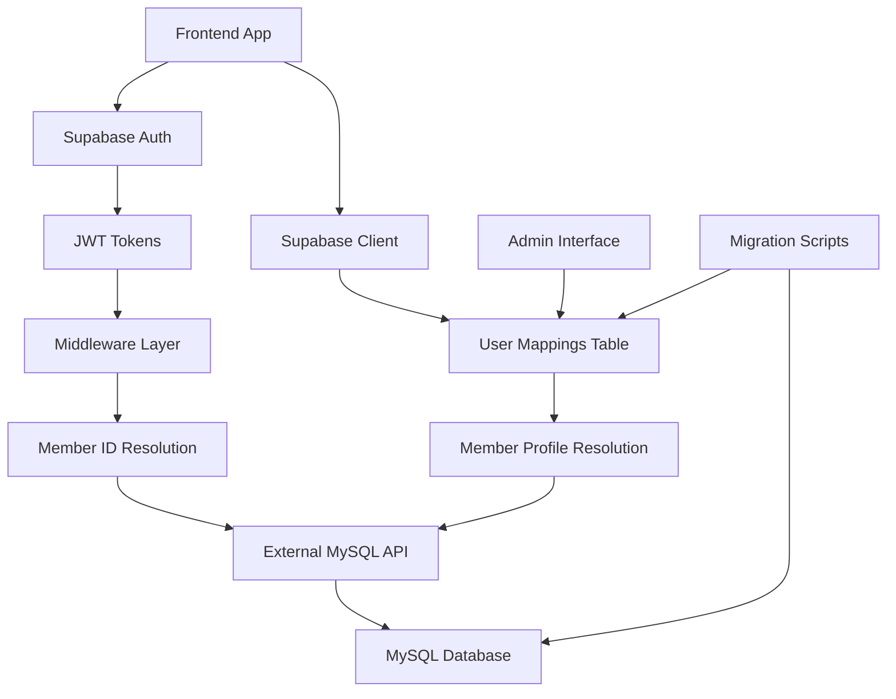

# TrueHearted Architecture Documentation

## Overview
TrueHearted is a comprehensive dating application that uses Supabase for authentication while maintaining existing MySQL data for profiles and application logic. This hybrid approach ensures data preservation while leveraging modern authentication infrastructure.

## Architecture Components

### 1. Authentication Layer (Supabase)
- **Primary Purpose**: User authentication, session management, JWT token handling
- **Technology**: Supabase Auth with PostgreSQL backend
- **Features**:
  - Email/password authentication
  - Social logins (Google, Facebook, etc.)
  - JWT token management
  - Password reset flows
  - Email confirmation

### 2. User Mapping Layer
- **Purpose**: Bridge between Supabase users and existing member profiles
- **Implementation**: `user_mappings` table in Supabase
- **Key Functions**:
  - Maps `supabase_user_id` ↔ `members.id`
  - Tracks migration status
  - Handles account linking scenarios

### 3. Frontend Application (React/Vite)
- **Framework**: React with TypeScript
- **Styling**: Tailwind CSS with shadcn/ui components
- **State Management**: React hooks and context
- **Authentication**: Supabase client SDK
- **Features**:
  - Responsive mobile-first design
  - Progressive Web App (PWA) capabilities
  - Real-time updates
  - Offline support

### 4. Data Layer (Hybrid Approach)

#### Supabase Database
- **Authentication data**: Users, sessions, tokens
- **Mapping data**: User account linkages
- **Real-time features**: Messaging, notifications
- **File storage**: Profile photos, media

#### External MySQL Database (Production)
- **Member profiles**: Complete user information
- **Application data**: Likes, matches, preferences
- **Legacy data**: Historical information
- **Business logic**: Complex matching algorithms

## Data Flow Architecture



## Security Architecture

### 1. Authentication Security
- **JWT Verification**: Server-side token validation
- **Row Level Security (RLS)**: Supabase policies
- **HTTPS Enforcement**: All API communications
- **Token Refresh**: Automatic session management

### 2. Data Access Control
- **Supabase RLS Policies**: Control access to mapping data
- **External API Security**: Authenticated endpoints for MySQL access
- **User Context**: All requests include resolved member ID
- **Audit Logging**: Track all data access and modifications

### 3. Privacy & Compliance
- **Data Minimization**: Only necessary data in Supabase
- **Encryption**: All sensitive data encrypted at rest
- **GDPR Compliance**: User data deletion capabilities
- **Consent Management**: User permission tracking

## Migration Strategy

### Phase 1: Preparation
1. **Database Setup**: Create user mapping infrastructure
2. **Frontend Updates**: Implement Supabase authentication
3. **Testing Environment**: Validate integration with test data
4. **Admin Tools**: Build mapping management interface

### Phase 2: Gradual Migration
1. **Email Matching**: Auto-link accounts by email
2. **Password Options**: 
   - Preserve passwords (if bcrypt compatible)
   - Force password reset workflow
3. **User Verification**: Allow users to verify account linking
4. **Rollback Capability**: Maintain ability to revert changes

### Phase 3: Production Cutover
1. **Maintenance Window**: Brief downtime for final migration
2. **Bulk Processing**: Migrate remaining users
3. **Validation**: Verify all accounts properly linked
4. **Go-Live**: Enable new authentication system

### Phase 4: Cleanup
1. **Legacy Cleanup**: Remove old authentication code
2. **Performance Optimization**: Tune queries and indexes
3. **Monitoring**: Implement production metrics
4. **Documentation**: Update operational procedures

## API Architecture

### Frontend ↔ Supabase
```typescript
// Direct Supabase client usage
import { supabase } from '@/integrations/supabase/client';

// Authentication
const { user, session } = await supabase.auth.getUser();

// Get mapped member ID
const { data } = await supabase.rpc('get_member_id_from_auth');

// Access mapped member data
const { data } = await supabase.rpc('get_current_member');
```

### Middleware Layer (External)
```typescript
// Express.js middleware example
async function resolveSupabaseUser(req, res, next) {
  const token = req.headers.authorization?.replace('Bearer ', '');
  
  // Verify JWT with Supabase
  const { data: user } = await supabase.auth.getUser(token);
  
  // Resolve member ID from mapping
  const { data: mapping } = await supabaseAdmin
    .from('user_mappings')
    .select('member_id')
    .eq('supabase_user_id', user.id)
    .single();
  
  req.memberId = mapping.member_id;
  next();
}
```

### External MySQL API
```typescript
// Protected endpoint with member context
app.get('/api/profiles/:memberId', authenticate, async (req, res) => {
  // req.memberId is resolved from Supabase JWT
  const profile = await mysql.query(
    'SELECT * FROM members WHERE id = ? AND id = ?',
    [req.params.memberId, req.memberId] // Ensure user can only access their data
  );
  res.json(profile);
});
```

## Deployment Architecture

### Production Environment
- **Frontend**: Vercel/Netlify with CDN
- **Supabase**: Managed PostgreSQL with global edge functions
- **External API**: Node.js/Express on AWS/Google Cloud
- **MySQL Database**: Managed MySQL service (AWS RDS/Google Cloud SQL)
- **Load Balancing**: Application load balancers
- **Monitoring**: Application and infrastructure monitoring

### Development Environment
- **Local Frontend**: Vite dev server
- **Supabase**: Development project
- **Local API**: Docker containers
- **Test Database**: Local MySQL instance

### CI/CD Pipeline
1. **Code Changes**: Git push triggers pipeline
2. **Testing**: Automated tests and security scans
3. **Build**: Frontend and backend builds
4. **Deploy**: Staged deployment with health checks
5. **Migration**: Database migration scripts
6. **Verification**: Post-deployment testing

## Cost & Scaling Considerations

### Supabase Costs
- **Database**: Based on storage and compute usage
- **Authentication**: Free tier: 50,000 users, then $0.00325 per user/month
- **Storage**: $0.021 per GB/month
- **Bandwidth**: $0.09 per GB
- **Functions**: $2 per 1M invocations

### Scaling Strategy
- **Horizontal Scaling**: Multiple API instances behind load balancer
- **Database Scaling**: Read replicas for MySQL
- **Caching**: Redis for frequently accessed data
- **CDN**: Global content delivery for static assets

### Cost Optimization
- **Connection Pooling**: Reduce database connections
- **Query Optimization**: Efficient database queries
- **Image Optimization**: Compress and resize user photos
- **Monitoring**: Track usage and optimize accordingly

## Security Best Practices

### 1. Authentication
- Multi-factor authentication support
- Rate limiting on login attempts
- Session timeout configuration
- Secure password policies

### 2. Data Protection
- Field-level encryption for sensitive data
- Regular security audits
- Penetration testing
- Vulnerability scanning

### 3. Operational Security
- Infrastructure as Code (IaC)
- Secrets management
- Access logging and monitoring
- Incident response procedures

## Monitoring & Observability

### Application Metrics
- User authentication success/failure rates
- API response times and error rates
- Database query performance
- User engagement metrics

### Infrastructure Metrics
- Server resource utilization
- Database connection pools
- Network latency and throughput
- Error rates and alerts

### Business Metrics
- User registration and retention
- Match success rates
- Feature usage analytics
- Revenue and conversion tracking

## Disaster Recovery

### Backup Strategy
- **Supabase**: Automated daily backups
- **MySQL**: Point-in-time recovery capability
- **File Storage**: Cross-region replication
- **Configuration**: Infrastructure as Code

### Recovery Procedures
- **RTO**: 4 hours maximum downtime
- **RPO**: 1 hour maximum data loss
- **Failover**: Automated for Supabase, manual for MySQL
- **Testing**: Monthly disaster recovery drills

This architecture provides a robust, scalable foundation for TrueHearted while preserving existing data and enabling modern authentication workflows.